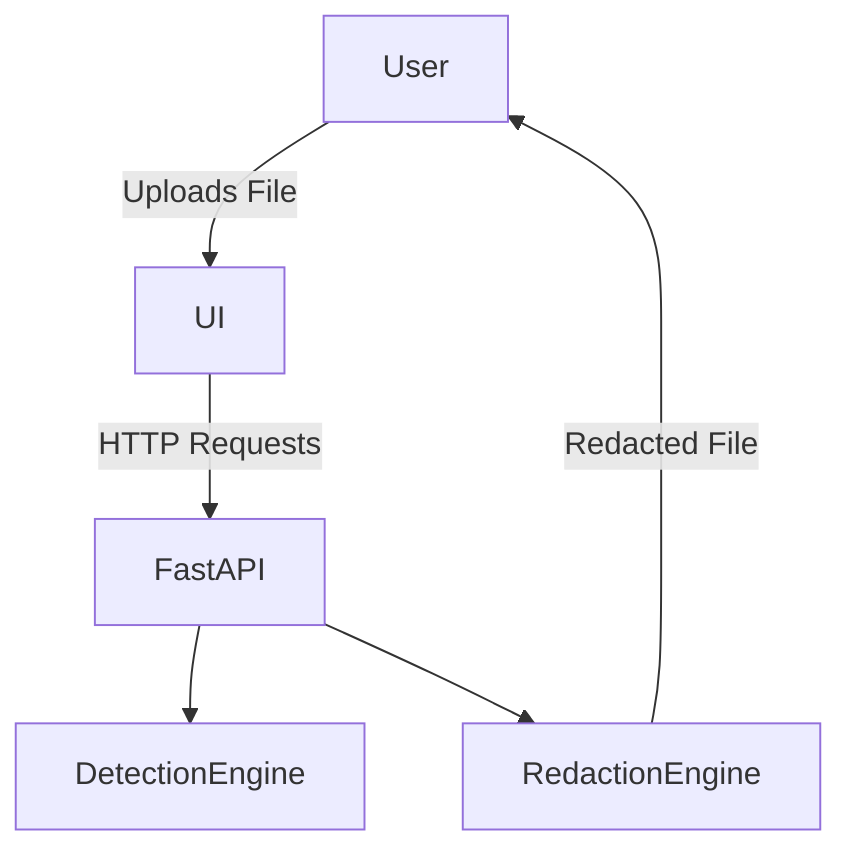
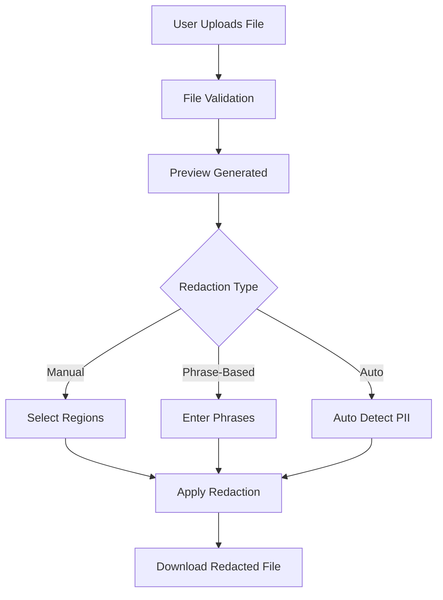
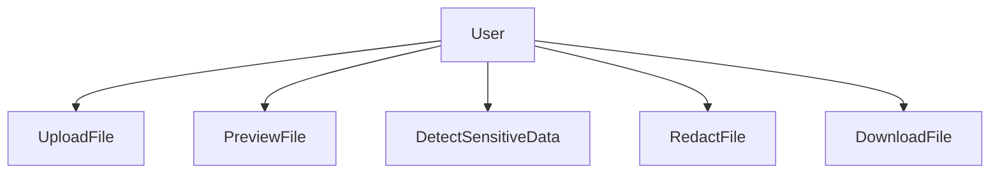
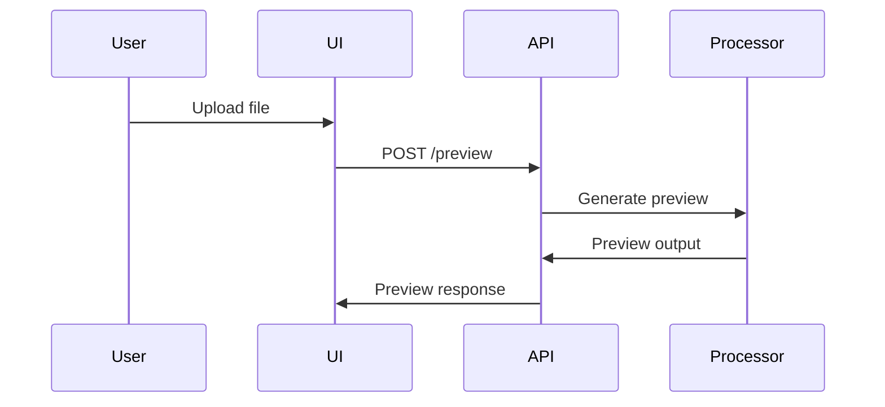
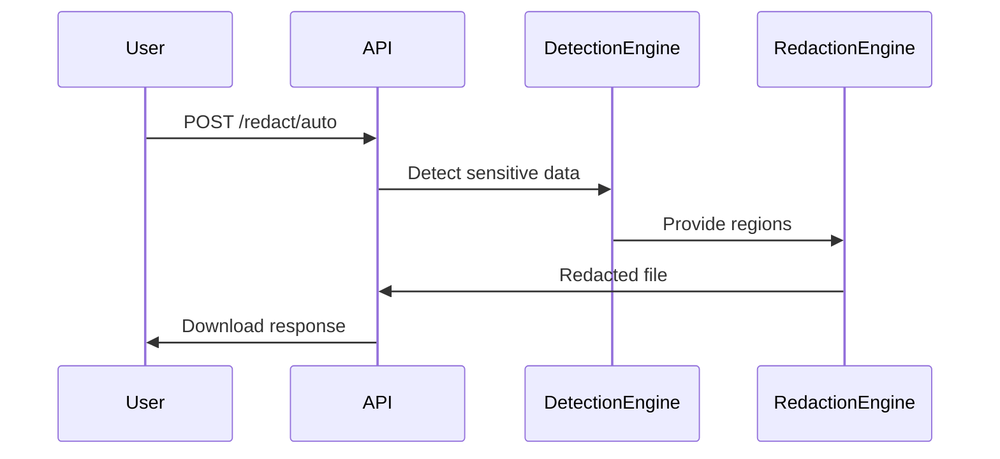
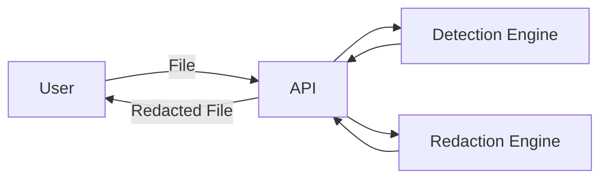
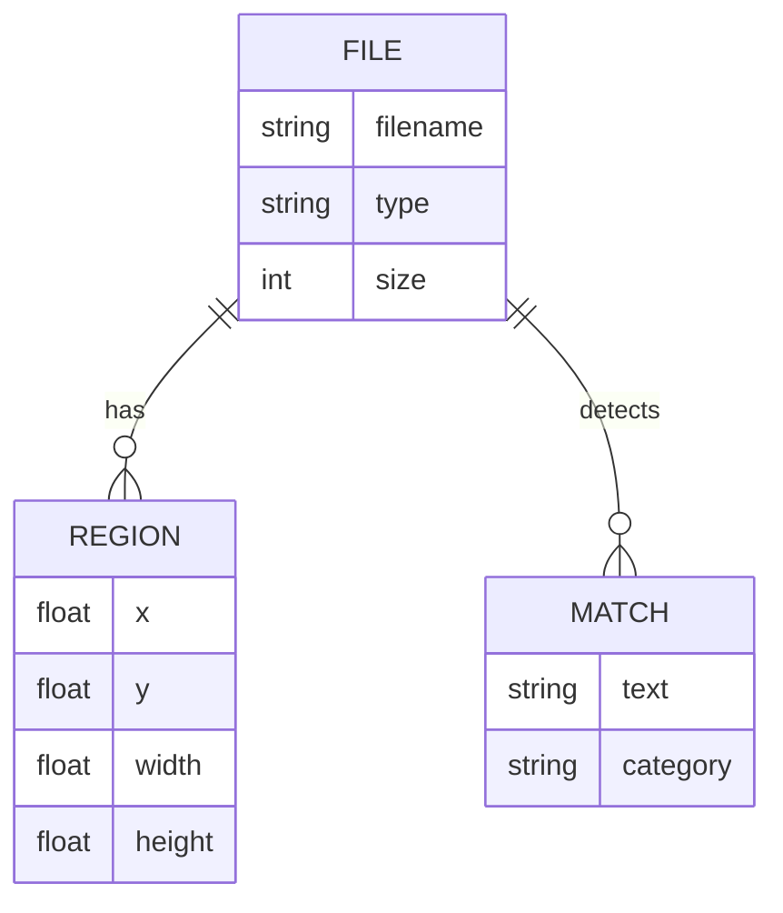

# Architecture – File Redaction Web Application

## 1) Overview

The **File Redaction Web Application** is a lightweight, web-based system designed to **detect and redact sensitive information (PII)** from documents and images.  
The MVP targets **single-user, stateless operation**, prioritizing privacy, safety, and robustness.

The backend is implemented using **FastAPI**, while the frontend uses **HTML/CSS/JavaScript**.  
Files are processed **in-memory** without persistence, and the system can be containerized using **Docker** for consistent deployment.

---

## 2) High-Level System Architecture

### Logical Components
- **User Interface**
  - File upload
  - Preview
  - Redaction controls
  - Download

- **API Layer (FastAPI)**
  - Upload & validation endpoints
  - Preview endpoints
  - Detection & redaction endpoints

- **Processing Layer**
  - Detection Engine (regex + context)
  - OCR Engine (optional – Tesseract)
  - Redaction Engine (PDF, Image, DOCX, XLSX)

---

## 3) System Context Diagram



4) Container / Component Diagram
```mermaid
graph LR
    Browser[Web Browser] --> API[FastAPI Server]

    API --> PDF[PDF Processor]
    API --> IMG[Image Processor]
    API --> DOCX[DOCX Processor]
    API --> XLSX[XLSX Processor]

    API --> OCR[OCR Engine (Optional)]
```

5) Frontend Architecture
Pages

Upload & Redaction Page

Preview Page

Download Confirmation

UI Modules

FileUploader

PreviewViewer

RedactionCanvas (manual regions)

PhraseInputPanel

AutoRedactButton

DownloadPanel

6) User Flow Diagram


7) Use Case Diagram


8) Sequence Diagram – Preview Flow


9) Sequence Diagram – Auto Redaction Flow


10) Data Flow Diagram


11) Conceptual Data Model (ER Diagram)


12) Security & Privacy Considerations

No user authentication (MVP scope)

No file or text persistence

Files processed in-memory per request

No external data transmission by default

Debug logging disabled in production mode

13) Scalability & Future Enhancements

Permanent PDF redaction (apply_redactions)

Batch file uploads

Password-protected PDF support

Authentication & RBAC

Audit logs for compliance

Separate UI and API containers

Cloud deployment (AWS / Azure)

14) Summary

This architecture ensures modularity, privacy, and reliability, making the File Redaction Web Application suitable for secure document handling while remaining extensible for future enterprise features. (See <attachments> above for file contents. You may not need to search or read the file again.)
